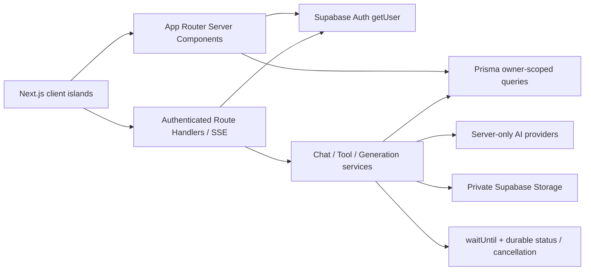

# Application foundation audit

> Phase 6B3 — Draft. Baseline commit: `d8f5c092422102d586a6537d1585df2bcc69de44`. This document is updated as findings are fixed.

## 1. Architecture overview



- Next.js 15 App Router and React 19 are used.
- Route pages, data reads, ownership checks, page headings, and initial lists are Server Components by default.
- Interactivity is isolated into client components for forms, menus, dialogs, SSE streams, generation recovery, cancel actions, and viewport behavior.
- Supabase Auth establishes identity. Prisma queries and mutations derive `userId` from the authenticated server session rather than client input.
- PostgreSQL/Prisma is the business source of truth. Browser storage is limited to theme preference and short-lived generation recovery IDs.

## 2. Route structure and rendering boundaries

### Public/authentication routes

- `/login`, `/register`, and `/auth/callback` use Supabase authentication.
- The auth layout is a Server Component; `AuthForm` is a small client island using a Server Action.
- Authenticated application pages call `requireUser`; `/admin` additionally calls `requireAdmin` and verifies the Prisma profile role server-side.

### Authenticated content routes

- `/`, `/account`, `/admin`, `/personas/**`, `/memories`, and `/tools/**` render server-owned page shells and initial data.
- `/chat` and `/chat/[conversationId]` load owned conversation/persona data on the server, then hand interaction to `ChatLayout`.
- Dynamic conversation, Persona, and history links must keep `prefetch={false}` where list size can grow.

### API and generation routes

- Chat, text tools, image analysis, image generation, Persona draft/avatar, brainstorm, status, cancellation, and private asset routes live under `app/api`.
- Each sensitive route obtains the server user, scopes database queries by that user, and returns only permitted data or a signed asset response.
- Transport abort is not treated as a business cancellation. Explicit cancel endpoints own the transition to `CANCELLED`.

## 3. AppShell audit

### Baseline

- `AppShell` supports `document` and `viewport` scroll modes.
- Desktop normal pages use natural document scrolling, a fixed sidebar, remaining-width content, and clamp-based gutters.
- Viewport workspaces are appropriate only for Chat and similarly bounded tools.
- `DesktopSidebar` and `MobileHeader` each resolve the same cached viewer data in independent Suspense boundaries.

### Finding F-01 — global mobile viewport coupling (blocking, resolved)

`MobileViewportSync` is mounted in the root layout. It writes `--visual-viewport-height` and `data-keyboard-open` on the root for every mobile route. `app-shell-root`, `.app-viewport`, dialogs, and Chat consume those global values.

Consequences:

- ordinary forms and Chat share one keyboard strategy even though they require different scroll models;
- focusing Chat can resize the entire page/root rather than only the Chat viewport;
- WebKit may scroll the layout viewport while the root height changes, leaving the composer near the visible top and a large blank region below;
- the root-level height mutation causes avoidable layout work across unrelated pages.

Resolution:

- Removed `MobileViewportSync`, root `--visual-viewport-height`, root keyboard state, and all ordinary-route VisualViewport listeners.
- Ordinary pages now use natural document scrolling at every width.
- `ChatLayout` alone mounts a controller that writes `--chat-viewport-top`, `--chat-viewport-height`, and `--keyboard-inset` on its own shell.
- Mobile Chat is fixed to the current visual viewport; document scroll remains stable and MessageList is the only primary scroller.

## 4. Chat shell audit

### Baseline structure

```text
Chat root (`.app-viewport`)
├── desktop conversation rail
└── conversation workspace
    ├── header
    ├── configuration/error notices
    └── content row
        ├── message column
        │   ├── MessageList (scroll container)
        │   └── ChatComposer
        └── optional assistant selector
```

### Existing strengths

- Only the message list is intended to scroll.
- Composer is in normal flex flow after messages rather than fixed relative to the document.
- Textarea uses a 16 px mobile font, composition-safe Enter handling, bounded auto-growth, and an internal overflow state.
- Conversation deletion, edit/resubmit, explicit stop, background detach, recovery, Markdown/code rendering, and scroll-to-bottom are real behaviors.

### Finding F-02 — viewport and anchor lifecycle (blocking, resolved)

- Chat currently inherits the root `--visual-viewport-height` instead of owning its visual viewport.
- The visual viewport `offsetTop` is recorded globally but not used to position the Chat shell.
- Message following only responds to message changes. It does not preserve a bottom anchor or historical reading position when viewport/composer height changes.
- The composer writes a global `--composer-height`, so its lifecycle can affect unrelated routes.

Resolution:

- Chat-only fixed shell uses visual viewport top/height on mobile; desktop remains a bounded workspace.
- One rAF merges viewport resize/scroll/focus/pageshow, suppresses sub-pixel writes, pauses while hidden, and removes every listener/variable on cleanup.
- MessageList and Composer ResizeObservers preserve a bottom anchor for followers and a clamped reading position for historical readers.
- Source contracts and Playwright helpers verify no focus `scrollIntoView`, `window.scrollTo`, document `scrollTop`, or root viewport writes.

## 5. Generation infrastructure audit

- Chat uses an SSE transport plus durable `Message.status` and owner-scoped status/cancel routes.
- Text/image/brainstorm tools use `ToolRun` with `PENDING`, `COMPLETE`, `ERROR`, and `CANCELLED` terminal states.
- Persona draft/avatar workflows use `GenerationRun` with expiry, owner scope, status, result, and error code.
- `registerGenerationTask` registers an already-running promise with Vercel `waitUntil` and falls back to Next `after` locally.
- Durable cancellation polls owner-scoped pending state and only explicit cancellation transitions a run.
- Recovery IDs are stored in `sessionStorage`; prompts, outputs, signed URLs, and server state are not stored there.
- Late completion writes are guarded with `updateMany(... status: PENDING)`, preventing overwrite of a terminal state.

### Finding F-03 — shared workspace presentation (audited, deliberately bounded)

Recovery, cancel, SSE, error, quota, and status semantics are sound but presentation code is repeated across text, image, Persona, and brainstorm workspaces. Phase 6B3 retained the existing shared recovery hook, cancel client, SSE observer, output presentation and status primitives; it did not rewrite stable provider or persistence logic merely to force a new abstraction. Further convergence remains low-priority technical debt.

## 6. Multi-Agent foundation audit

- Exactly four fixed roles are defined: Analyst, Creative, Critic, Planner.
- Four workers run with bounded concurrency and one synthesis call, for at most five provider calls.
- Worker rows are created durably and uniquely by run/role and run/position.
- Individual worker failures are honest; synthesis requires at least two successful workers.
- Timeout, explicit cancellation, output limits, `ToolOutputGuard`, usage quota, owner scope, partial persistence, and recovery already exist.
- No retry loop, network search, fake token count, fake confidence, or Vibe Coding behavior exists.

Phase 6B3 added Lumen worker cards, copy/download, honest partial failure/timeout labels, recovery phase, real completed-worker count, and explicit synthesis state. Mobile uses the permitted single-column layout. Fixed four-worker/one-coordinator behavior and the maximum five calls are unchanged.

## 7. Authentication and authorization audit

- Supabase `auth.getUser()` is called server-side for authenticated identity.
- `requireUser` redirects unauthenticated page requests; API routes return 401.
- `requireAdmin` rechecks the Prisma profile role on the server; middleware is not the sole authorization boundary.
- Conversation, Persona, Memory, ToolRun, BrainstormWorker, GeneratedImage, GenerationRun, and asset lookups are owner-scoped.
- No service-role key or AI key is exposed through `NEXT_PUBLIC_*`.

Phase 6B3 preserved these boundaries. Admin data reads are gated by `requireAdmin`; the role action derives the acting user from the server session, validates target UUID/role, blocks self-change, protects the final admin, and executes the update in a Serializable transaction.

## 8. Database and Storage audit

- Prisma models cover Profile, Conversation, Message, Persona, Memory/MemoryEmbedding, ToolRun/ToolAsset, GeneratedImage, GenerationRun, BrainstormWorker, ModelConfig, and AppSetting.
- Current schema and migrations already represent the required Phase 6B3 data. No schema or migration change is justified by the front-end integration audit.
- Uploaded tool assets and generated images use private Storage paths. Browser access is mediated by authenticated routes and signed responses.
- Storage paths and database URLs must not be exposed as public business data.

## 9. Client state audit

- Server records remain the source of truth.
- Optimistic Chat messages are temporary UI state and are reconciled to server IDs from SSE.
- Theme preference is local UI preference.
- Recovery IDs in `sessionStorage` are permitted; no prompt/output/signed URL is stored there.
- Forms and generation buttons already expose pending/disabled states in most flows; Phase 6B3 must verify double-submit prevention and IME composition for every revised form.

## 10. Performance baseline

Baseline production build at `d8f5c092`:

| Route | Route size | First Load JS |
|---|---:|---:|
| `/` | 1.59 kB | 120 kB |
| `/chat` | 135 B | 171 kB |
| `/tools` | 1.59 kB | 120 kB |
| `/tools/brainstorm` | 9.26 kB | 172 kB |
| `/tools/image-generate` | 24.9 kB | 150 kB |
| Shared | — | 102 kB |

Baseline validation:

- `pnpm install --frozen-lockfile`: passed.
- `pnpm test`: 93 files / 549 tests passed.
- `pnpm typecheck`: passed.
- `pnpm build`: passed and produced the table above.
- `pnpm lint`: the nested local workspace exposed a missing ESLint root boundary and loaded both repository and parent `@next/next` plugins; add `root: true` to make the repository self-contained.
- `pnpm exec prisma validate`: requires placeholder or real `DATABASE_URL` and `DIRECT_URL`; no production database was contacted.

Performance constraints for Phase 6B3:

- Home First Load JS target is at most 132 kB (110% of 120 kB), preferably unchanged.
- Keep Home as a Server Component and do not load Framer Motion, image generation, brainstorm, or admin code into its initial client graph.
- Keep heavy workspaces route-scoped and dynamic list prefetch bounded.

Final production build:

| Route | Route size | First Load JS | Baseline delta |
|---|---:|---:|---:|
| `/` | 2.03 kB | 124 kB | +4 kB First Load |
| `/chat` | 135 B | 173 kB | +2 kB |
| `/tools` | 2.03 kB | 124 kB | +4 kB |
| `/tools/brainstorm` | 9.57 kB | 176 kB | +4 kB |
| `/tools/image-generate` | 24.2 kB | 154 kB | +4 kB |
| `/admin` | 2.93 kB | 125 kB | route-scoped client action only |
| Shared | — | 103 kB | +1 kB after React security patch |

Home remains below the 132 kB budget (124 kB, +3.3% from 120 kB). It is still a Server Component and does not import Framer Motion, image generation, brainstorm workspace, or Admin client code. Heavy workspaces remain route-scoped.

## 11. Security findings and constraints

- Preserve server-derived identity, RLS, Prisma ownership, private buckets, signed responses, OutputGuard, prompt boundaries, and safe logs.
- Do not log full prompts, full model outputs, cookies, Authorization headers, database URLs, or private Storage paths.
- Do not expose mock auth or copy prototype data.
- React 19.1.1 was in the React team's disclosed RSC RCE/DoS affected line. It was patched to React/React DOM 19.1.8; Next 15.5.20 already exceeds the official 15.5 fixed version.
- `pnpm audit --prod` found PostCSS `<8.5.10`; the workspace now overrides all PostCSS consumers to 8.5.16 and the final audit reports no known vulnerabilities.

## 12. Technical debt and fix register

| ID | Severity | Finding | Phase 6B3 disposition |
|---|---|---|---|
| F-01 | Blocking | Root-level VisualViewport height couples all routes | Resolved: Chat-only controller; root sync deleted |
| F-02 | Blocking | Chat does not position from `offsetTop` or preserve scroll anchor on resize | Resolved with fixed shell, mock viewport and anchor tests |
| F-03 | Medium | Repeated generation presentation patterns | Existing safe shared primitives retained; deeper rewrite deferred |
| F-04 | Medium | Main navigation omits feature entries | Resolved on desktop, command menu and mobile full menu |
| F-05 | Medium | Admin route lacks real management | Resolved with read model and bounded role action |
| F-06 | Medium | ESLint config is not a repository root | Resolved with `root: true` |
| F-07 | Low | Prototype/current tokens diverge | Resolved with Lumen semantic tokens |
| F-08 | Low | Safe-area/lock regression coverage | Dialog/dropdown contracts retained; full public viewport matrix added |
| F-09 | Critical | React 19.1.1 RSC advisory exposure | Resolved with React 19.1.8 |
| F-10 | Moderate | PostCSS audit advisory | Resolved with 8.5.16 workspace override |

## 13. Completed and deferred work

Completed before Phase 6B3 (from PR #18 base): Home Server Component split, removal of Home Framer Motion, dynamic-history prefetch limits, desktop document scrolling, AppShell document/viewport modes, mobile-limited VisualViewport listeners, navigation feedback, and reduced Home bundle.

Phase 6B3 retained those gains and replaced the faulty root viewport strategy. It also completed Lumen surfaces, real Home/Account/Admin data views, dependency patches, the viewport matrix, and final architecture documentation.

Deferred intentionally:

- Phase 7A2 and Vibe Coding.
- Code execution, Shell, file-writing agents, unbounded agents, external queues, Redis/Kafka, Python/Django backends.
- Production deployment or domain/environment-variable changes.
- Database migrations unless a new blocking defect is proven (none found in the initial audit).

## 14. Phase 7A2 prerequisites

Before Phase 7A2 may start, the owner should have:

- real iPhone Safari and Android keyboard/device acceptance for Chat;
- complete mobile/desktop feature entry coverage;
- passing test/lint/typecheck/build/Prisma/e2e checks;
- stable generation cancellation/recovery and owner isolation;
- documented threat model for code execution, filesystem, secrets, sandboxing, quotas, audit logs, and abuse handling;
- explicit approval to expand the product/security scope.

## 15. Final verification

Executed from the repository root on 2026-07-18:

- `pnpm install --frozen-lockfile`: passed.
- `pnpm test`: 95 files / 555 tests passed.
- `pnpm lint`: passed with zero warnings.
- `pnpm typecheck`: passed.
- `pnpm build`: passed; final route table is recorded above.
- `pnpm exec prisma validate`: passed with local placeholder connection strings; it did not connect to or mutate a database.
- `pnpm audit --prod`: no known vulnerabilities.
- `pnpm test:e2e --workers=1`: 15 passed / 21 explicitly skipped. Public Desktop Chromium, Mobile Chromium and WebKit iPhone projects passed; protected-route tests skipped because no `PLAYWRIGHT_AUTH_STATE` was supplied.
- The public acceptance matrix covered all 20 requested phone, landscape, tablet and desktop sizes plus 200% root text scaling, with no horizontal overflow or console/page errors.

No Prisma Schema, migration, RLS, bucket, environment variable, domain or production deployment was changed. No ZIP, extracted prototype, `.env`, credential, `node_modules`, `.next`, prompt/output dump or private Storage path was committed.

The remaining blocker is hardware/credential acceptance, not an unimplemented code path: real iPhone Safari, Android Chrome, WeChat WebView, PWA, and authenticated Chat/Admin mutation flows remain unverified locally. WebKit emulation is explicitly not claimed as real iPhone Safari.
